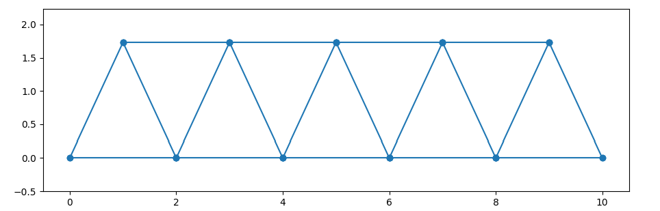
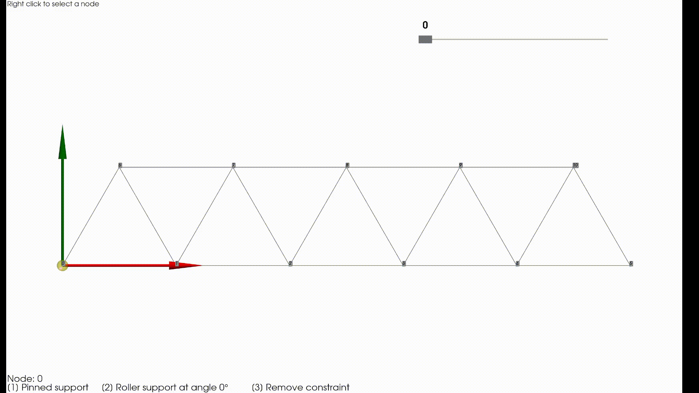

# DSKR Tools
Paket orodij za laboratorijske vaje pri predmetu **Dinamika strojev in konstrukcij (DSKR)**. 
Vključuje numerično analizo lastnih nihanj 2D paličnih konstrukcij z metodo končnih elementov (MKE).

## Funkcionalnosti
* **Modeliranje paličij:** Definicija vozlišč, elementov in materialnih lastnosti ($A, E, \rho$).
* **Modalna analiza:** Izračun globalnih togostnih ($K$) in masnih ($M$) matrik ter reševanje problema lastnih vrednosti.
* **Upoštevanje robnih pogojev:** Podpora za poljubne omejitve prostostnih stopenj preko matrike omejitev.
* **Interaktivna vizualizacija:** Animacija lastnih oblik z uporabo drsnika za izbiro načina nihanja.

## Primer uporabe
```
import numpy as np
import scipy as sp
import sympy as sym
import matplotlib.pyplot as plt
from DSKR_tools import Truss2D
%matplotlib qt

# Definiraj vozlišča
nodes = np.array([
    [0.0, 0.0], [2.0, 0.0], [4.0, 0.0], [6.0, 0.0], [8.0, 0.0], [10.0, 0.0], # Spodaj (0-5)
    [1.0, 1.732], [3.0, 1.732], [5.0, 1.732], [7.0, 1.732], [9.0, 1.732]    # Zgoraj (6-10)
])

# Definiraj elemente
elements = np.array([
    # Spodnji pas
    [0, 1], [1, 2], [2, 3], [3, 4], [4, 5],
    # Zgornji pas
    [6, 7], [7, 8], [8, 9], [9, 10],
    # Diagonale (cik-cak vzorec)
    [0, 6], [6, 1], [1, 7], [7, 2], [2, 8], [8, 3], [3, 9], [9, 4], [4, 10], [10, 5]
])

# Ustvari model (A=presek, E=modul elastičnosti, rho=gostota)
model = Truss(nodes, elements, A=1e-4, E=210e9, rho=7850)

# Prikažemo paličje
model.display_truss()
```


```
# Nastavimo robne pogoje (omejitve)
model.edit_constraints()
```



```
# Zaženi animacijo lastnih oblik
model.animate_mode_shapes(scale=2)
```

