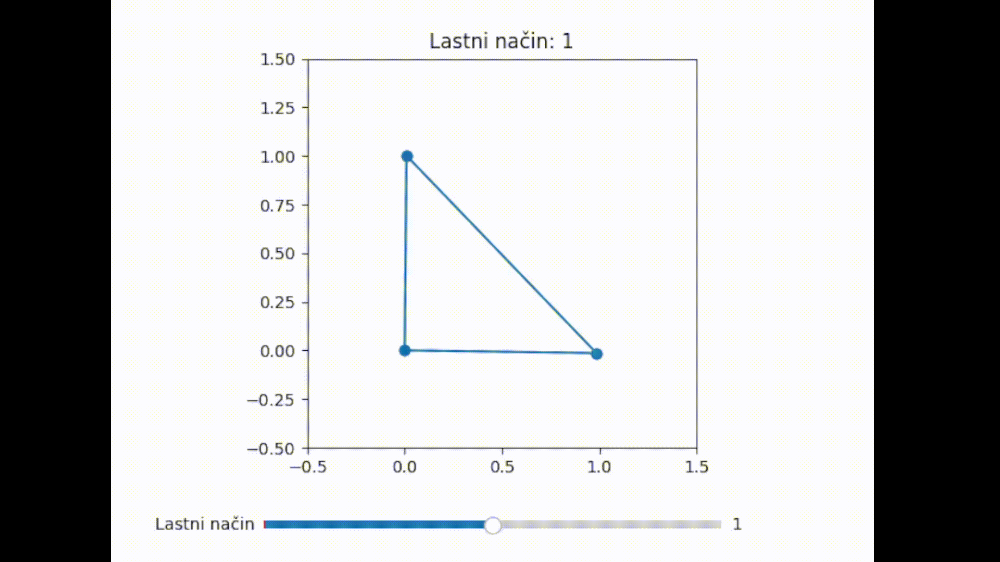

# DSKR Tools
Paket orodij za laboratorijske vaje pri predmetu **Dinamika strojev in konstrukcij (DSKR)**. 
Vključuje numerično analizo lastnih nihanj 2D paličnih konstrukcij z metodo končnih elementov (MKE).

## Funkcionalnosti
* **Modeliranje paličij:** Definicija vozlišč, elementov in materialnih lastnosti ($A, E, \rho$).
* **Modalna analiza:** Izračun globalnih togostnih ($K$) in masnih ($M$) matrik ter reševanje problema lastnih vrednosti.
* **Upoštevanje robnih pogojev:** Podpora za poljubne omejitve prostostnih stopenj preko matrike omejitev.
* **Interaktivna vizualizacija:** Animacija lastnih oblik z uporabo drsnika za izbiro načina nihanja.

## Primer uporabe
```import numpy as np
from DSKR_tools import Truss

# Definiraj vozlišča (x, y)
nodes = np.array([[0, 0], [1, 0], [0.5, 0.8]])

# Definiraj elemente (indeksi vozlišč)
elements = np.array([[0, 1], [1, 2], [2, 0]])

# Ustvari model (A=presek, E=modul elastičnosti, rho=gostota)
model = Truss(nodes, elements, A=1e-4, E=210e9, rho=7850)

# Zaženi animacijo lastnih oblik
model.animate_mode_shapes(scale=0.2)
```

